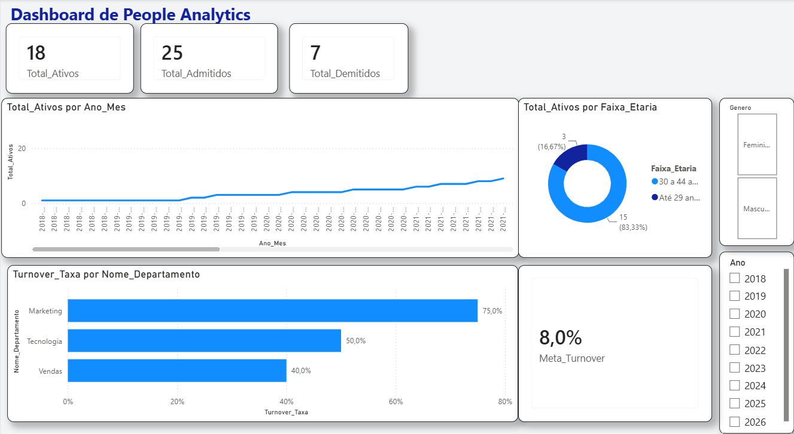
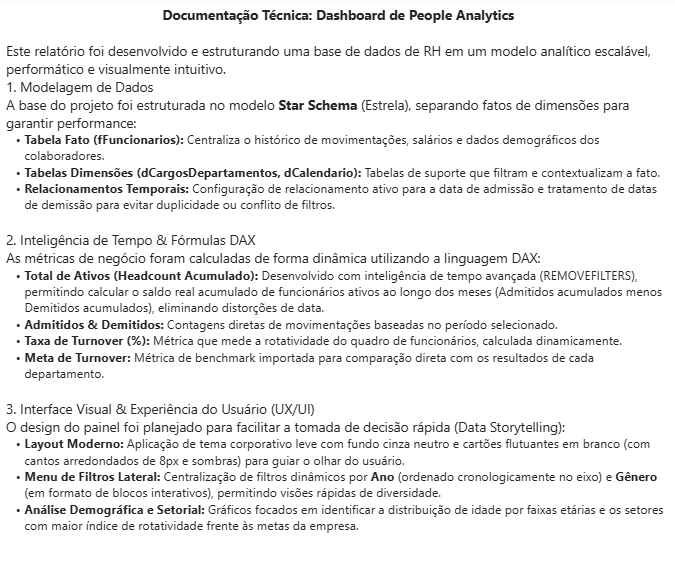

# 📊 Dashboard de People Analytics (Power BI)

Este projeto consiste em um dashboard analítico focado em Recursos Humanos (People Analytics), projetado para apoiar a tomada de decisões estratégicas de lideranças e gestores de departamento. 

O painel apresenta indicadores críticos de movimentação de pessoal, distribuição demográfica e taxas de rotatividade.

---

## 🖥️ Visualização do Dashboard

### Página 1: Painel de Indicadores


### Página 2: Documentação e Arquitetura do Projeto


---

## 🛠️ Tecnologias e Técnicas Utilizadas

*   **Ferramenta Principal:** Microsoft Power BI Desktop
*   **Modelagem de Dados:** Arquitetura Star Schema (Estrela) com tabelas Fato (`fFuncionarios`) e Dimensões (`dCargosDepartamentos`, `dCalendario`).
*   **Tratamento de Dados (ETL):** Power Query (M) para limpeza de nulos, transformação de faixas etárias e estruturação de colunas de apoio.
*   **Linguagem DAX (Medidas Principais):**
    *   **Saldo Acumulado de Ativos (Headcount):** Utilização de `REMOVEFILTERS` para criar uma curva temporal acumulada real, desvinculada das flutuações das datas de admissão.
    *   **Taxa de Turnover (%):** Cálculo dinâmico de rotatividade mensal e anual.
*   **UX/UI Design:** Aplicação de paleta de cores corporativa neutra, cartões flutuantes com sombras suaves para alívio visual e menus interativos de segmentação (filtros por Ano e Gênero).

---
---

## 💾 Fórmulas DAX Utilizadas (Métricas 1 a 3)

Aqui estão as fórmulas mais complexas utilizadas para construir a inteligência de dados deste painel:

```dax
// 1. Total de Ativos (Headcount Acumulado Dinâmico)
Total_Ativos = 
VAR DataMax = MAX('dCalendario'[Data])
VAR AdmitidosAcumulado = 
    CALCULATE(
        [Total_Admitidos],
        FILTER(
            ALL('dCalendario'),
            'dCalendario'[Data] <= DataMax
        )
    )
VAR DemitidosAcumulado = 
    CALCULATE(
        [Total_Demitidos],
        FILTER(
            ALL('dCalendario'),
            'dCalendario'[Data] <= DataMax
        )
    )
RETURN
    AdmitidosAcumulado - DemitidosAcumulado


// 2. Taxa de Turnover (%)
Turnover_Taxa = 
DIVIDE(
    ([Total_Admitidos] + [Total_Demitidos]) / 2,
    [Total_Ativos],
    0
)


// 3. Meta de Turnover (Benchmark de RH)
Meta_Turnover = AVERAGE('dCargosDepartamentos'[Meta_Turnover_Ano])

## 📁 Estrutura do Repositório

*   `/images`: Capturas de tela utilizadas na documentação.
*   `Dashboard_People_Analytics.pbix`: Arquivo original do Power BI para download e análise.
